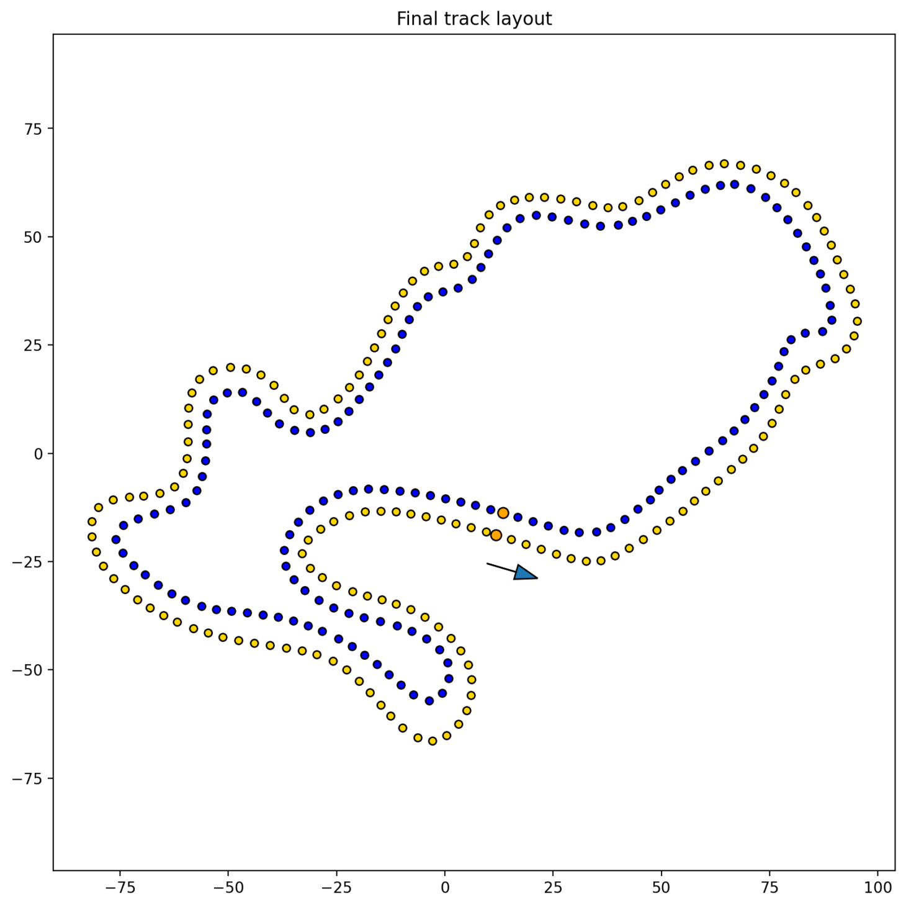

# drawing-to-fsd-layout

A tool that converts a hand drawn track layout to a track layout that can be used in in Formula Student Driverless Simulators

<!-- It will turn this image  into this  -->
<!-- Table with before and after images side by side -->
| Input | Plot of output |
| --- | --- |
|  |  |

Clear hand-drawn tracks should also work. They do not have to be filled in.

There is now also a canvas option in the script.

The extracted track can be downloaded as a JSON file with x,y and color values are available for each cone, as well as an LYT file that can be used in Live for Speed.

The tool is hosted on Streamlit Cloud and can be accessed [here](https://drawing-to-fsd-layout.streamlit.app/).

## Installation

If you want to run the tool locally you can follow these steps:

```bash
git clone https://github.com/papalotis/drawing-to-fsd-layout.git

cd drawing-to-fsd-layout

# optional: create a virtual environment

pip install -r requirements.txt

streamlit run streamlit_app.py
```

The tool will be available at `http://localhost:8501`